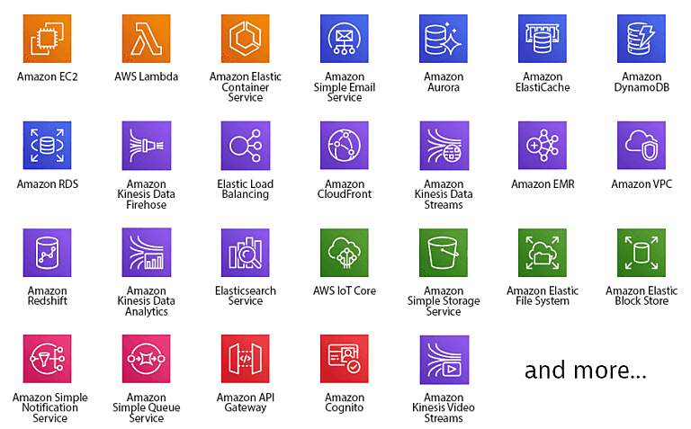

# AWS Services

AWS is a cloud computing platform that provides a wide range of services.

  

Originating internally in 2002 at Amazon.com, AWS became publicly available in 2003, marking the inception of cloud services. The journey continued with the launch of the Simple Queue Service (SQS) in 2004, followed by SQS, EC2, and S3 two years later. Expanding its reach globally, AWS established its first European data center in 2007. Today, AWS stands as a global platform trusted by millions, including renowned entities like Netflix, Airbnb, and NASA.

## AWS Cloud Use Cases

AWS offers a versatile services for building sophisticated, scalable, and secure applications. Here are some common use cases:

| Use Case                 | Services                                                     |
| ------------------------ | ------------------------------------------------------------ |
| Web Applications         | Amplify, API Gateway, Lambda, S3, CloudFront, Route 53, etc. |
| Containers               | EKS, ECS, Fargate, ECR, etc.                                 |
| Mobile Applications      | Cognito, S3, DynamoDB, etc.                                  |
| Databases                | RDS, DynamoDB, DocumentDB, Aurora, Cassandra, etc.           |
| Backup and Recovery      | Backup, Storage Gateway, etc.                                |
| Big Data                 | EMR, Redshift, Kinesis Firehose, Glue, etc.                  |
| Security and Compliance  | IAM, GuardDuty, Inspector, etc.                              |
| Machine Learning         | SageMaker, Rekognition, Polly, etc.                          |
| Internet of Things (IoT) | IoT Core, Greengrass, FreeRTOS, etc.                         |
| Game Development         | GameLift, Lumberyard, etc.                                   |
| Disaster Recovery        | CloudEndure, etc.                                            |
| Hybrid Cloud             | Outposts, VPN, Direct Connect, etc.                          |
| DevOps                   | CodePipeline, CodeBuild, CodeDeploy, etc.                    |
| and more...              |                                                              |

## AWS Widely Used Services

- Identity and Access Management (IAM): Secure access to AWS services and resources.
- Simple Storage Service (S3): Scalable object storage for data backup, archiving, and analytics.
- Elastic Compute Cloud (EC2): Scalable virtual servers in the cloud.
- Relational Database Service (RDS): Managed relational databases in the cloud.
- Lambda: Serverless compute service for running code without provisioning or managing servers.
- Elastic Kubernetes Service (EKS): Managed Kubernetes service for running containerized applications.
- Elastic Load Balancing (ELB): Distribute incoming application traffic across multiple targets.
- Route 53: Scalable domain name system (DNS) web service.
- CloudFront: Content delivery network (CDN) service.
- CloudFormation: Infrastructure as code (IaC) service.
- and more...

## AWS Global Infrastructure

AWS operates in 25 geographic regions around the world, with 80 availability zones. Each region is a separate geographic area, and each availability zone consists of one or more data centers. The global infrastructure is designed for high availability and fault tolerance.

## AWS Pricing

AWS offers a pay-as-you-go pricing model, which means you pay only for the services you use. The pricing is based on the resources you consume, such as compute, storage, and data transfer. AWS provides a pricing calculator to estimate the cost of services based on your usage.

## AWS Free Tier

AWS offers a free tier for new customers to get started with the platform. The free tier includes limited access to AWS services for 12 months, with usage limits on compute, storage, and data transfer. The free tier is a great way to explore AWS services and learn how to use them without incurring costs.

## Conclusion

AWS provides a wide range of services for building, deploying, and managing applications in the cloud. Whether you are a startup, enterprise, or government agency, AWS has the tools and resources to help you succeed. By leveraging AWS services, you can scale your applications, improve security, and reduce costs. Explore the AWS platform and discover how it can benefit your organization.

## Resources

- [AWS Documentation](https://docs.aws.amazon.com/)
- [AWS Whitepapers](https://aws.amazon.com/whitepapers/)
- [AWS Training and Certification](https://aws.amazon.com/training/)
